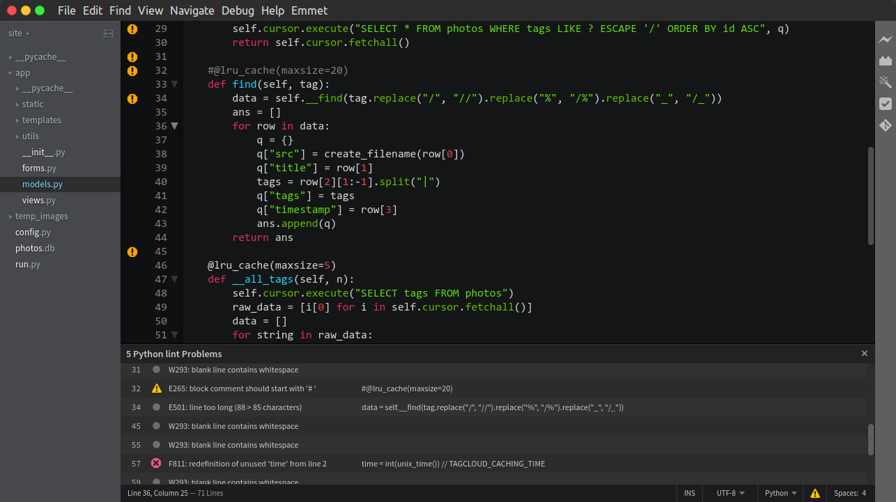
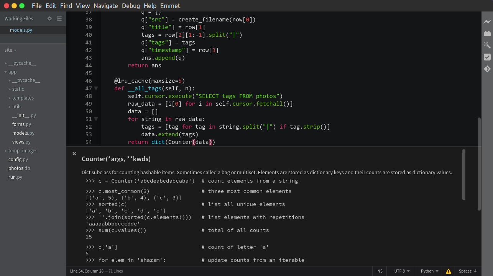
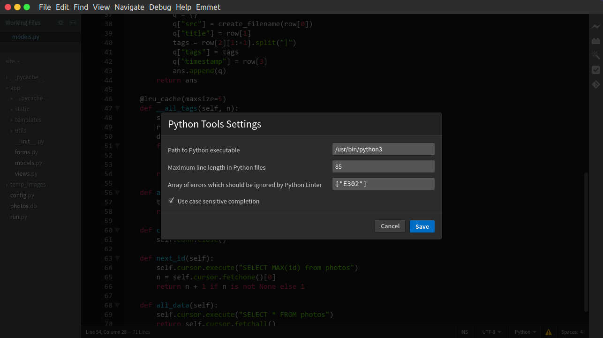

## brackets-python-tools: Python development with Brackets

A set of tools which will make Brackets your favourite backend IDE.

> *Please note that this project is still in alpha. Feel free to report an issue or add a pull request!*

### Features
  - Smart autocompletion
  - Go to definition/assignment
  - Inline Python documentation
  - Linter

### Some screenshots

*Python Autocompletion*


*Linting via Flake8*


*Inline documentation*


*Settings dialog*

### Installation
You can install Python Tools from official Brackets Extension Registry.
Additionally, you'll need:
  - Python up and running (Python 3 preferably)
  - `flake8` module (optional) for linting and style checking. You may install it via pip:
    ```bash
    ~$ pip install flake8
    ```
  - `docutils` module (optional) for documentation rendering. It can be install with pip:
    ```bash
    ~$ pip install docutils
    ```

### Usage
This Extension uses Python 3 interpreter in your path by default. You can customize interpreter either in Preferences File or in Python Tools Settings tab.

### Settings
Settings are accessible through standart brackets settings interface or 'File' menu 🡒 Python Tools Settings.

Currently available settings:
  - `pathToPython`: String<br>
    Full path to python executable. Default value is `python`.
  - `isCaseSensitive`: Boolean<br>
    If code completion should be case sensitive. Default is `true`.
  - `maxLineLength`: Number<br>
    Maximum line length in Python files. Default: `79`.
  - `ignoredErrors`: Array<br>
    Array of errors which should be ignored by Python Linter. Default: `[]`

### Credits
This project is based on the [Python Jedi Brackets](https://github.com/saravanan-k90/python-jedi-brackets) project.

### License
The source code is licensed MIT. See [LICENSE.md](LICENSE.md) for more.